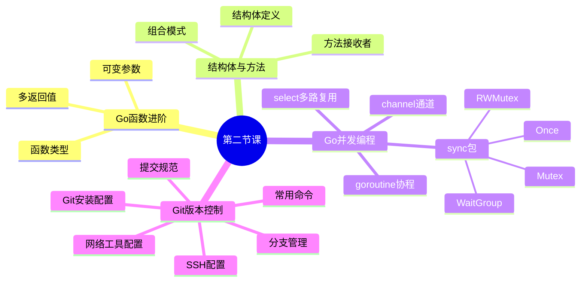
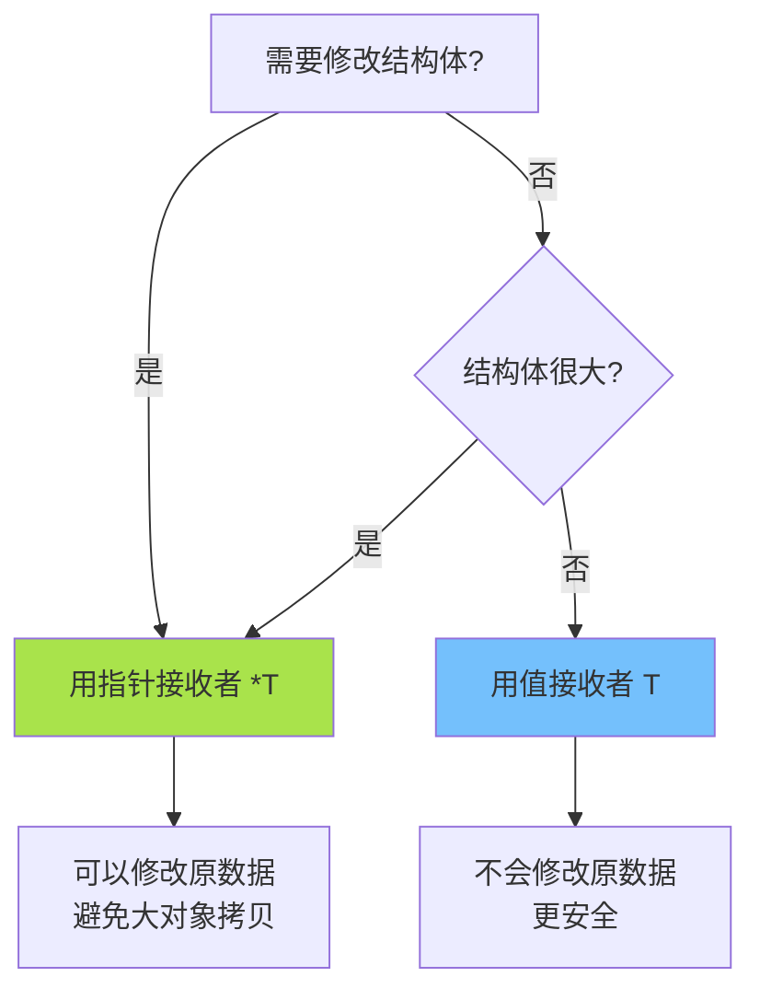
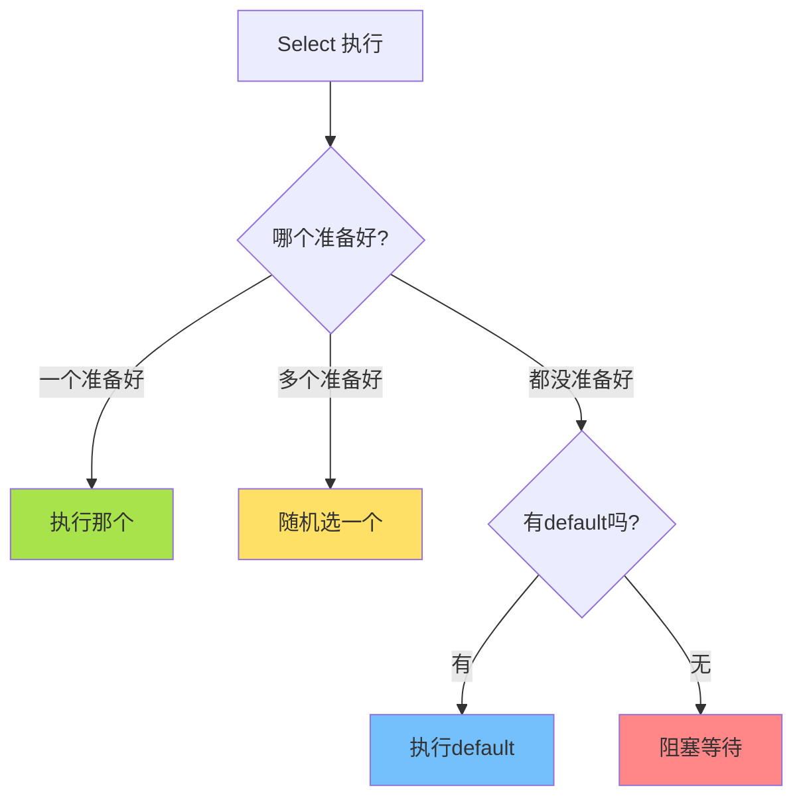
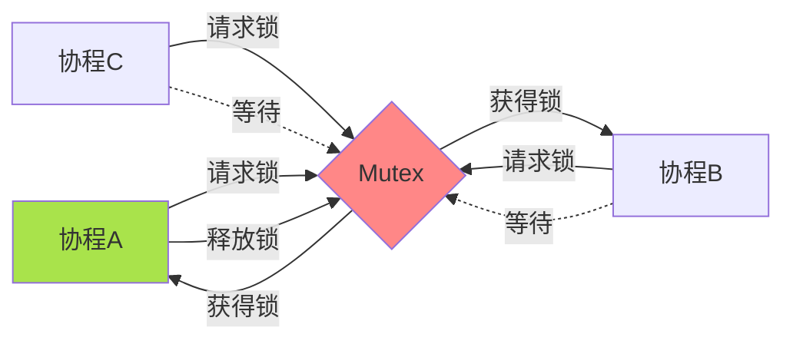
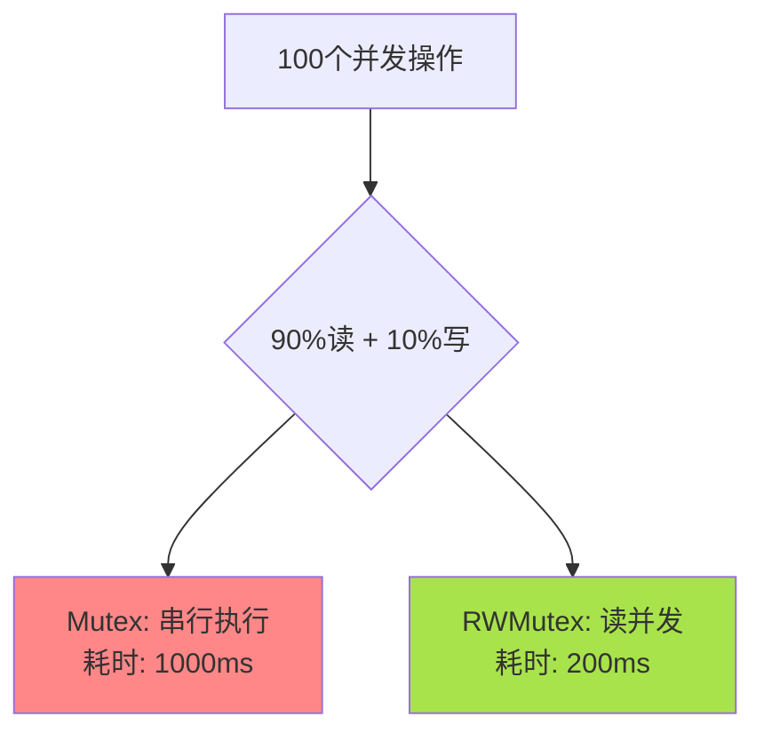
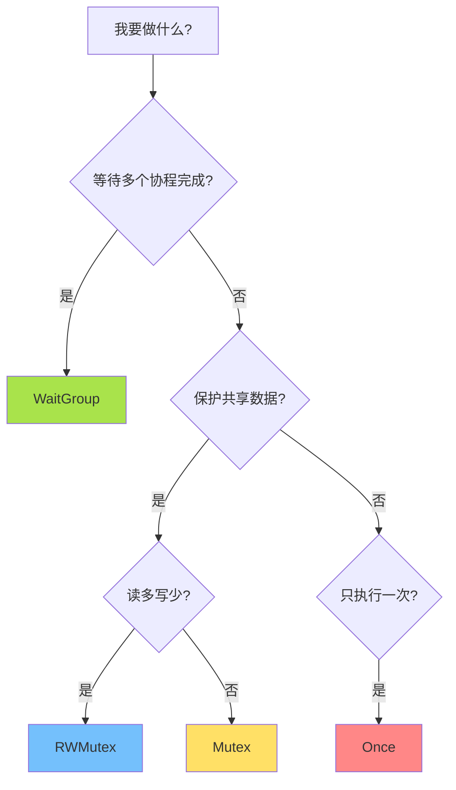
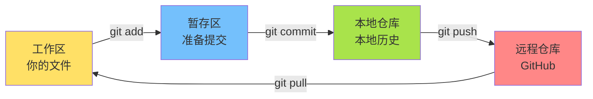
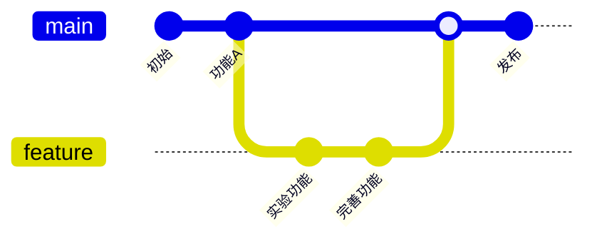

# 第二节课 Go 进阶语法 + Git 使用

> **第二节课：函数进阶 · 结构体方法 · 并发编程 · Git实战**


---

## 📋 本节课内容




---

## 第一部分:Go 函数进阶

### 1.1 多返回值 - Go的独特设计

#### 🎯 为什么需要多返回值?

很多时候,函数不仅要返回结果,还要告诉你是否成功。

**其他语言的做法**:通常只能返回一个值,要么用对象包装,要么用异常处理。 **Go 的做法**:直接返回多个值,简单直接!

> **💡 Go的设计哲学**:明确的错误处理优于隐式的异常。Go不使用try-catch,而是让你主动检查错误,这样代码更清晰,错误不会被忽略。

#### 💡 基本使用

```go
// 返回两个值:结果 + 错误信息
func divide(a, b float64) (float64, error) {
    if b == 0 {
        return 0, fmt.Errorf("除数不能为零")
    }
    return a / b, nil  // nil 表示没有错误
}

// 使用
result, err := divide(10, 2)
if err != nil {
    fmt.Printf("错误: %v\n", err)
} else {
    fmt.Printf("结果: %.2f\n", result)  // 结果: 5.00
}
```

> **⚠️ 为什么这样设计?** Go认为错误是程序的正常部分,应该显式处理而不是隐藏在异常机制中。这让代码更可预测、更容易维护。

#### 📌 命名返回值

给返回值起个名字,代码更清晰!这体现了Go"清晰胜于聪明"的设计哲学。

```go
// 普通方式
func calculate(a, b int) (int, int) {
    sum := a + b
    product := a * b
    return sum, product
}

// 命名返回值(推荐)
// 这些返回变量会在函数体开始时自动声明并初始化为零值
// 可以在函数中直接使用，return 时会自动返回这些变量的值
func calculate(a, b int) (sum int, product int) {
    sum = a + b      // 直接赋值
    product = a * b
    return           // 自动返回 sum 和 product
    // return sum, product
}

// 使用
s, p := calculate(3, 4)
fmt.Printf("和: %d, 积: %d\n", s, p)  // 和: 7, 积: 12
```

> **⚠️ 小提示**:命名返回值在短函数中很清晰,但函数太长时容易搞混,要注意!Go提倡函数要短小精悍。

#### 📖 忽略不需要的返回值

使用下划线 `_` 忽略不需要的值:

```go
// 只关心错误
_, err := divide(10, 0)
if err != nil {
    fmt.Println("操作失败:", err)
}

// 只关心结果(非常不建议如此操作,会丢失错误信息)
result, _ := divide(10, 2)
fmt.Println("结果:", result)
```


---

### 1.2 可变参数函数

#### 🎯 什么是可变参数?

有时候不确定会传入多少个参数,比如求和函数:`sum(1, 2)` 或 `sum(1, 2, 3, 4, 5)`。

**其他语言**:Python用`*args`,JavaScript用`...rest` **Go**:用`...`表示可变参数

#### 💡 基本语法

```go
func sum(numbers ...int) int {
    total := 0
    for _, num := range numbers {
        total += num
    }
    return total
}

// 可以传入任意数量的参数
fmt.Println(sum(1, 2, 3))           // 6
fmt.Println(sum(1, 2, 3, 4, 5))     // 15
fmt.Println(sum())                  // 0
```

> **💡 原理**:`numbers ...int` 实际上是个切片 `[]int`,只是不需要你手动创建。这体现了Go"提供便利但不隐藏机制"的设计。

#### 🔧 实用示例

```go
// 格式化日志
func log(level string, messages ...string) {
    fmt.Printf("[%s] ", level)
    for i, msg := range messages {
        fmt.Print(msg)
        if i < len(messages)-1 {
            fmt.Print(" | ")
        }
    }
    fmt.Println()
}

// 使用
log("INFO", "服务启动")
log("ERROR", "数据库连接失败", "重试中", "第3次")
// 输出:
// [INFO] 服务启动
// [ERROR] 数据库连接失败 | 重试中 | 第3次
```

#### 📦 展开切片

如果你已经有个切片,可以用 `...` 展开:

```go
numbers := []int{1, 2, 3, 4, 5}

// 展开切片作为参数
result := sum(numbers...)  // 等同于 sum(1, 2, 3, 4, 5)
fmt.Println(result)        // 15
```


---

### 1.3 函数类型 - 函数也是"值"

#### 🎯 函数可以当变量用

在 Go 中,函数是"一等公民",可以像数字、字符串一样传递和使用。

> **类比**:就像你可以把数字 `x = 5` 赋值给变量,也可以把函数赋值给变量。

```go
// 定义函数类型
type Calculator func(int, int) int

// 两个函数
func add(a, b int) int {
    return a + b
}

func multiply(a, b int) int {
    return a * b
}

// 接受函数作为参数
func calculate(a, b int, op Calculator) int {
    return op(a, b)
}

// 使用
fmt.Println(calculate(5, 3, add))       // 8
fmt.Println(calculate(5, 3, multiply))  // 15
```

#### 💡 匿名函数

可以直接定义一个没有名字的函数:

```go
// 直接传入匿名函数
result := calculate(5, 3, func(x, y int) int {
    return x - y
})
fmt.Println(result)  // 2
```


---

## 第二部分:结构体与方法

### 2.1 结构体 - 组织你的数据

#### 🎯 为什么需要结构体?

当你需要把相关的数据组织在一起时,就用结构体。Go使用 `.` 来访问相关字段。

> **类比**:就像一个学生有姓名、年龄、成绩,把这些信息打包在一起。

**其他语言**:用"类"(Class) **Go**:用"结构体"(Struct),更简单!

> **💡 Go的设计哲学**:Go没有类,没有继承,而是提倡用结构体和接口来组织代码。这让代码更简单、更灵活。

#### 💡 定义和使用

```go
// 定义学生结构体
type Student struct {
    Name  string
    Age   int
    Grade string
}

// 创建学生 - 方式1(推荐)
s1 := Student{
    Name:  "张三",
    Age:   20,
    Grade: "大二",
}

// 创建学生 - 方式2
s2 := Student{"李四", 21, "大三"}  // 按顺序赋值

// 创建学生 - 方式3(指针)
s3 := &Student{
    Name:  "王五",
    Age:   19,
}
// Grade 会自动初始化为空字符串 ""

// 访问和修改
fmt.Println(s1.Name)     // 张三
s1.Age = 21              // 修改年龄
fmt.Println(s1.Age)      // 21
```

> **💡 大写和小写**:
>
> * `Name`(大写开头):其他包可以访问(公开)
> * `name`(小写开头):只有当前包可以访问(私有)
>
> Go用简单的大小写来控制访问权限,不需要 public/private 关键字。

#### 📦 嵌套结构体

结构体里可以包含其他结构体:

```go
type Address struct {
    Province string
    City     string
}

type Person struct {
    Name    string
    Age     int
    Address Address  // 嵌套
}

// 使用
p := Person{
    Name: "小明",
    Age:  25,
    Address: Address{
        Province: "广东",
        City:     "深圳",
    },
}

fmt.Println(p.Address.City)  // 深圳
```


---

### 2.2 组合优于继承 - Go的"继承"方式

#### 🎯 匿名嵌套(字段提升)

**其他语言**:用继承(子类继承父类) **Go**:用组合(把一个结构体嵌入另一个),更灵活!

> **💡 Go的设计哲学**:**组合优于继承**(Composition over Inheritance)
>
> * 继承容易造成紧耦合,修改父类会影响所有子类
> * 组合让代码更灵活,可以随意组合不同的功能
> * 避免了多重继承的"菱形问题"

```go
type Person struct {
    Name string
    Age  int
}

type Address struct {
    City string
}

// 匿名嵌入(没有字段名)
type Teacher struct {
    Person   // 匿名嵌入 - 这就是"组合"
    Address  // 匿名嵌入
    Subject string
}

// 创建
t := Teacher{
    Person:  Person{Name: "李老师", Age: 35},
    Address: Address{City: "北京"},
    Subject: "数学",
}

// 神奇的地方:可以直接访问!
fmt.Println(t.Name)     // 李老师 (不需要 t.Person.Name)
fmt.Println(t.City)     // 北京 (不需要 t.Address.City)
fmt.Println(t.Subject)  // 数学
```

> **💡 字段提升**:匿名嵌入的字段会"提升"到外层,可以直接访问,就像它们原本就在这里一样!这让组合用起来像继承,但更灵活。


---

### 2.3 方法 - 给结构体添加"功能"

#### 🎯 什么是方法?

方法就是"属于"某个结构体的函数。

> **类比**:学生有个方法叫"计算平均分",矩形有个方法叫"计算面积"。

```go
type Rectangle struct {
    Width  float64
    Height float64
}

// 定义方法:(r Rectangle) 是接收者
func (r Rectangle) Area() float64 {
    return r.Width * r.Height
}

// 使用
rect := Rectangle{Width: 10, Height: 5}
area := rect.Area()
fmt.Printf("面积: %.2f\n", area)  // 面积: 50.00
```

#### 📊 值接收者 vs 指针接收者(重要!)

这是 Go 中非常重要的概念,理解它能写出更高效的代码。



**值接收者示例**(不会修改原数据)

```go
type Counter struct {
    Count int
}

// 值接收者:接收的是副本
func (c Counter) IncrementWrong() {
    c.Count++  // 修改的是副本,原数据不变
}

// 使用
counter := Counter{Count: 0}
counter.IncrementWrong()
fmt.Println(counter.Count)  // 0(没有改变!)
```

**指针接收者示例**(会修改原数据)

```go
// 指针接收者:接收的是指针
func (c *Counter) Increment() {
    c.Count++  // 修改原数据
}

// 使用
counter := Counter{Count: 0}
counter.Increment()
fmt.Println(counter.Count)  // 1(成功修改!)
```

> **💡 如何选择?**
>
> * **需要修改数据** → 必须用指针 `*T`
> * **结构体很大** → 推荐用指针(避免拷贝开销)
> * **只是读取数据且结构体小** → 可以用值 `T`
> * **不确定** → 用指针更保险
>
> **Go的建议**:为了一致性,一个类型的方法要么都用值接收者,要么都用指针接收者。

**其他语言对比**:

* Python、Java的方法总是可以修改对象
* Go让你明确选择,更灵活也更安全!

#### 💼 完整示例:学生成绩管理

```go
type Student struct {
    Name   string
    Scores []int
}

// 值接收者:只读操作
func (s Student) Average() float64 {
    if len(s.Scores) == 0 {
        return 0
    }
    sum := 0
    for _, score := range s.Scores {
        sum += score
    }
    return float64(sum) / float64(len(s.Scores))
}

// 值接收者:判断
func (s Student) IsPassed() bool {
    return s.Average() >= 60
}

// 指针接收者:修改操作
func (s *Student) AddScore(score int) {
    s.Scores = append(s.Scores, score)
}

// 指针接收者:删除最低分
func (s *Student) RemoveLowestScore() {
    if len(s.Scores) == 0 {
        return
    }

    // 找最小值的索引
    minIndex := 0
    for i, score := range s.Scores {
        if score < s.Scores[minIndex] {
            minIndex = i
        }
    }

    // 删除
    s.Scores = append(s.Scores[:minIndex], s.Scores[minIndex+1:]...)
}

// 使用
func main() {
    stu := Student{
        Name:   "小明",
        Scores: []int{85, 90, 78, 92},
    }

    fmt.Printf("平均分: %.2f\n", stu.Average())      // 86.25
    fmt.Printf("是否及格: %v\n", stu.IsPassed())     // true

    stu.AddScore(88)
    fmt.Println("添加成绩后:", stu.Scores)            // [85 90 78 92 88]

    stu.RemoveLowestScore()
    fmt.Println("删除最低分后:", stu.Scores)          // [85 90 92 88]
    fmt.Printf("新平均分: %.2f\n", stu.Average())    // 88.75
}
```


---

## 第三部分:Go 并发编程

### 3.1 执行模式：同步、异步、串行、并发、并行

#### 📚 五种执行模式定义

**1. 同步 (Synchronous)** - 调用后等待结果返回

**2. 异步 (Asynchronous)** - 调用后立即返回,不等待

**3. 串行 (Serial)** - 任务一个接一个顺序执行

**4. 并发 (Concurrency)** ⭐ **本节重点** - 多任务交替执行,逻辑上同时

**5. 并行 (Parallelism)** - 多任务真正同时执行,物理上同时

#### 🔍 并发 vs 并行 (核心概念)

**并发 (Concurrency) - 单核CPU快速切换**

```mermaid
gantt
    title 时间轴 →
    dateFormat ss
    axisFormat %S秒

    section CPU核心
    任务A :a1, 00, 01
    任务B :b1, 01, 02
    任务C :c1, 02, 03
    任务A :a2, 03, 04
    任务B :b2, 04, 05
    任务C :c2, 05, 06
```



**特点**: 交替切换,看起来同时执行

**并行 (Parallelism) - 多核CPU同时执行**


**特点**: 真正同时,同一时刻都在执行

**关键区别:**

* 并发: 一个人做三件事(来回切换)
* 并行: 三个人各做一件事(同时进行)

> **💡 Go的设计**: Go通过goroutine和channel让并发编程简单自然


---

### 3.2 Goroutine - 轻量级"线程"

#### 🎯 什么是 Goroutine?

Goroutine 是 Go 的"轻量级线程",创建成本极低。

**其他语言**:创建线程很"重",数量有限 **Go**:创建 Goroutine 很"轻",可以创建成千上万个!

#### 📊 对比

| 特性  | 传统线程 | Goroutine |
|-----|------|-----------|
| 内存占用 | 1-2MB | 2KB(500倍差距!) |
| 创建速度 | 慢    | 快         |
| 数量限制 | 几千个  | 几十万个      |

> **💡 为什么这么轻?** Goroutine使用可增长的栈,初始只有2KB,需要时自动增长。而线程的栈大小固定,通常1-2MB。

#### 💡 超简单的使用

只需要一个 `go` 关键字!

```go
func sayHello(name string) {
    for i := 0; i < 3; i++ {
        fmt.Printf("Hello %s! (%d)\n", name, i+1)
        time.Sleep(100 * time.Millisecond)
    }
}

func main() {
    // 普通调用:同步执行
    sayHello("同步")

    // 加 go:异步执行
    go sayHello("异步1")
    go sayHello("异步2")

    // 等待 goroutine 完成
    time.Sleep(1 * time.Second)
}

// 可能的输出(顺序不确定):
// Hello 同步! (1)
// Hello 同步! (2)
// Hello 同步! (3)
// Hello 异步1! (1)
// Hello 异步2! (1)
// Hello 异步1! (2)
// Hello 异步2! (2)
// ...
```

#### 🎪 各种方式创建 Goroutine

```go
// 1. 普通函数
go sayHello("协程1")

// 2. 匿名函数
go func() {
    fmt.Println("我是匿名函数")
}()

// 3. 带参数的匿名函数
go func(msg string) {
    fmt.Println(msg)
}("传入的消息")

// 4. 闭包(捕获外部变量)
name := "张三"
go func() {
    fmt.Println("你好,", name)  // 可以访问外部变量
}()
```

> **⚠️ 重要**:主程序结束时,所有 Goroutine 都会被强制停止!所以需要等待它们完成。


---

### 3.3 Channel - Goroutine之间的"传话筒"

#### 🎯 为什么需要 Channel?

> **类比**:两个人(Goroutine)在不同房间工作,需要传递消息,Channel 就是连接房间的管道。

> **💡 Go的设计哲学**:**"不要通过共享内存来通信,而要通过通信来共享内存"**
>
> 这是Go并发编程的核心思想!
>
> * 传统方式:多个线程访问同一块内存,需要加锁(复杂、容易出错)
> * Go的方式:用Channel传递数据,天然线程安全(简单、不易出错)


#### 🔧 基本操作

```go
// 1. 创建 channel
ch := make(chan int)          // 无缓冲
buffered := make(chan int, 5) // 有缓冲(容量5)

// 2. 发送数据
ch <- 42

// 3. 接收数据
value := <-ch

// 4. 关闭 channel
close(ch)

// 5. 遍历 channel
for value := range ch {
    fmt.Println(value)
}
```

#### 📊 无缓冲 vs 有缓冲

**无缓冲 Channel**:必须有人接收,发送才能成功

> **类比**:像直接递东西,必须有人伸手接,否则你的手一直举着。

```go
ch := make(chan int)  // 容量为0

go func() {
    ch <- 42  // 会阻塞,直到有人接收
    fmt.Println("发送成功")
}()

value := <-ch  // 接收,上面的发送才能完成
fmt.Println("收到:", value)
```

**有缓冲 Channel**:可以先放进去,后面再取

> **类比**:像信箱,可以先放信,对方有空再取。

```go
ch := make(chan int, 3)  // 容量为3

// 可以连续发送3个,不会阻塞
ch <- 1
ch <- 2
ch <- 3
fmt.Println("发送了3个值")

// 后面再接收
fmt.Println(<-ch)  // 1
fmt.Println(<-ch)  // 2
fmt.Println(<-ch)  // 3
```

#### 💡 实用示例:生产者-消费者

```go
package main

import (
    "fmt"
    "time"
)

// 生产者
func producer(ch chan<- int) {  // chan<- 表示只能发送
    for i := 1; i <= 5; i++ {
        fmt.Printf("生产: %d\n", i)
        ch <- i
        time.Sleep(500 * time.Millisecond)
    }
    close(ch)  // 生产完毕,关闭channel
}

// 消费者
func consumer(ch <-chan int) {  // <-chan 表示只能接收
    for num := range ch {  // 自动接收,直到channel关闭
        fmt.Printf("  消费: %d\n", num)
        time.Sleep(1 * time.Second)
    }
}

func main() {
    ch := make(chan int, 2)  // 缓冲区大小为2

    go producer(ch)
    consumer(ch)

    fmt.Println("所有任务完成")
}

// 输出:
// 生产: 1
//   消费: 1
// 生产: 2
// 生产: 3
//   消费: 2
// 生产: 4
// ...
```

> **💡 只能发送/接收**:
>
> * `chan<- int`:只能发送的channel(防止你误接收)
> * `<-chan int`:只能接收的channel(防止你误发送)
> * 这是类型安全的保护!体现了Go"在编译期发现问题"的设计。


---

### 3.4 Select - 同时等待多个Channel

#### 🎯 什么是 Select?

> **类比**:你在等快递,同时等外卖,谁先到处理谁。Select 就是这样!

```go
select {
case msg1 := <-ch1:
    fmt.Println("收到 ch1:", msg1)
case msg2 := <-ch2:
    fmt.Println("收到 ch2:", msg2)
case ch3 <- 42:
    fmt.Println("发送到 ch3")
default:
    fmt.Println("没有任何 channel 准备好")
}
```

#### 📌 Select 的规则



#### 💡 超时控制

最常用的场景:给操作加个超时!

```go
package main

import (
    "fmt"
    "time"
)

func fetchData(ch chan<- string) {
    time.Sleep(2 * time.Second)  // 模拟耗时操作
    ch <- "数据获取成功"
}

func main() {
    ch := make(chan string)

    go fetchData(ch)

    // 设置1秒超时
    select {
    case result := <-ch:
        fmt.Println(result)
    case <-time.After(1 * time.Second):
        fmt.Println("超时!操作耗时过长")
    }
}

// 输出: 超时!操作耗时过长
```

> **💡 time.After**:创建一个channel,指定时间后会发送一个值,完美配合select实现超时!这是Go标准库的优雅设计。

#### 🎯 监听多个 Channel

```go
package main

import (
    "fmt"
    "time"
)

func main() {
    ch1 := make(chan string)
    ch2 := make(chan string)
    quit := make(chan bool)

    // 1秒后发送
    go func() {
        time.Sleep(1 * time.Second)
        ch1 <- "消息1"
    }()

    // 2秒后发送
    go func() {
        time.Sleep(2 * time.Second)
        ch2 <- "消息2"
    }()

    // 3秒后发送退出信号
    go func() {
        time.Sleep(3 * time.Second)
        quit <- true
    }()

    // 持续监听
    for {
        select {
        case msg := <-ch1:
            fmt.Println("收到:", msg)
        case msg := <-ch2:
            fmt.Println("收到:", msg)
        case <-quit:
            fmt.Println("退出!")
            return
        }
    }
}

// 输出:
// 收到: 消息1
// 收到: 消息2
// 退出!
```

#### 🔧 非阻塞操作

使用 `default` 实现非阻塞:

```go
// 尝试接收,如果没有就放弃
select {
case value := <-ch:
    fmt.Println("收到:", value)
default:
    fmt.Println("channel是空的,不等了")
}

// 尝试发送,如果满了就放弃
select {
case ch <- 42:
    fmt.Println("发送成功")
default:
    fmt.Println("channel已满,不发了")
}
```


---

### 3.5 sync 包 - 协程同步利器

#### 🎯 为什么需要 sync 包?

虽然 Channel 是 Go 推荐的协程通信方式,但有些场景用 sync 包的同步原语更合适:

> **类比**:Channel 像传话筒(传递数据),sync 包像红绿灯(控制访问)。

**适用场景对比:**

| 场景  | 推荐方案 | 原因  |
|-----|------|-----|
| 传递数据 | Channel | Go 的设计哲学 |
| 等待一组任务完成 | sync.WaitGroup | 简单直接 |
| 保护共享资源 | sync.Mutex | 传统且高效 |
| 只读一次的配置 | sync.Once | 保证单次执行 |
| 高并发读多写少 | sync.RWMutex | 性能优化 |

> **💡 Go的设计哲学回顾**:
>
> * 优先使用 Channel 在协程间通信
> * 当需要传统的锁机制时,使用 sync 包
> * 两者结合使用,发挥各自优势


---

#### 📦 sync.WaitGroup - 等待协程完成

\*\*问题:\*\*之前我们用 `time.Sleep` 等待 goroutine,但这样很不精确。

**解决方案:**`sync.WaitGroup` 可以精确等待所有 goroutine 完成!

> **类比**:就像点名,所有人都到齐了才开始活动。

**基本使用:**

```go
package main

import (
    "fmt"
    "sync"
    "time"
)

func worker(id int, wg *sync.WaitGroup) {
    defer wg.Done()  // 完成时通知 WaitGroup(推荐用defer)

    fmt.Printf("Worker %d 开始工作\n", id)
    time.Sleep(time.Second)
    fmt.Printf("Worker %d 完成工作\n", id)
}

func main() {
    var wg sync.WaitGroup

    // 启动5个 worker
    for i := 1; i <= 5; i++ {
        wg.Add(1)  // 计数器 +1
        go worker(i, &wg)
    }

    wg.Wait()  // 阻塞,直到计数器归零
    fmt.Println("所有 worker 完成!")
}

// 输出(顺序可能不同):
// Worker 1 开始工作
// Worker 5 开始工作
// Worker 2 开始工作
// Worker 3 开始工作
// Worker 4 开始工作
// Worker 1 完成工作
// Worker 3 完成工作
// ...
// 所有 worker 完成!
```

**三个核心方法:**

```go
var wg sync.WaitGroup

wg.Add(n)    // 计数器 +n (启动 goroutine 前调用)
wg.Done()    // 计数器 -1 (goroutine 结束时调用)
wg.Wait()    // 阻塞,直到计数器为 0
```

**⚠️ 常见错误:**

```go
// ❌ 错误:在 goroutine 内部 Add
for i := 0; i < 5; i++ {
    go func(id int) {
        wg.Add(1)  // 错误!可能在 Wait 之后才执行
        defer wg.Done()
        // ...
    }(i)
}

// ✅ 正确:在启动 goroutine 前 Add
for i := 0; i < 5; i++ {
    wg.Add(1)  // 正确!保证在 Wait 前执行
    go func(id int) {
        defer wg.Done()
        // ...
    }(i)
}
```

**💼 实用示例:下载多个文件**

```go
package main

import (
    "fmt"
    "sync"
    "time"
)

func download(url string, wg *sync.WaitGroup) {
    defer wg.Done()

    fmt.Printf("开始下载: %s\n", url)
    time.Sleep(time.Second)  // 模拟下载
    fmt.Printf("完成下载: %s\n", url)
}

func main() {
    urls := []string{
        "file1.zip",
        "file2.zip",
        "file3.zip",
    }

    var wg sync.WaitGroup

    for _, url := range urls {
        wg.Add(1)
        go download(url, &wg)
    }

    wg.Wait()
    fmt.Println("所有文件下载完成!")
}

// 输出(顺序可能不同):
// 开始下载: file1.zip
// 开始下载: file2.zip
// 开始下载: file3.zip
// 完成下载: file1.zip
// 完成下载: file3.zip
// 完成下载: file2.zip
// 所有文件下载完成!
```

> **💡 对比**:没有 WaitGroup 就要用 `time.Sleep` 瞎等,有了它就能精确等待所有任务完成!


---

#### 🔒 sync.Mutex - 互斥锁

**问题:多个 goroutine 同时修改同一个变量会出现**竞态条件(race condition),导致结果错误!

```go
// 危险的代码!
var counter = 0

for i := 0; i < 1000; i++ {
    go func() {
        counter++  // 多个 goroutine 同时修改,结果不可预测!
    }()
}
```

\*\*解决方案:\*\*使用 `sync.Mutex` 互斥锁保护共享资源。

> **类比**:公共卫生间,一次只能一个人进,其他人要在外面等。



**基本使用:**

```go
package main

import (
    "fmt"
    "sync"
)

type SafeCounter struct {
    mu    sync.Mutex
    count int
}

func (c *SafeCounter) Increment() {
    c.mu.Lock()         // 加锁
    c.count++           // 安全修改
    c.mu.Unlock()       // 解锁
}

func (c *SafeCounter) Value() int {
    c.mu.Lock()         // 读取也要加锁
    defer c.mu.Unlock() // defer 确保一定会解锁
    return c.count
}

func main() {
    counter := SafeCounter{}
    var wg sync.WaitGroup

    // 1000 个 goroutine 同时累加
    for i := 0; i < 1000; i++ {
        wg.Add(1)
        go func() {
            defer wg.Done()
            counter.Increment()
        }()
    }

    wg.Wait()
    fmt.Println("最终值:", counter.Value())  // 总是 1000(正确!)
}
```

**核心方法:**

```go
var mu sync.Mutex

mu.Lock()    // 加锁(阻塞,直到获得锁)
mu.Unlock()  // 解锁
```

**⚠️ 重要提醒:**

```go
// ❌ 忘记解锁会导致死锁!
mu.Lock()
// ... 如果这里 return 或 panic,锁永远不会释放
mu.Unlock()

// ✅ 使用 defer 确保一定解锁
mu.Lock()
defer mu.Unlock()  // 推荐!无论如何都会执行
// ... 安全操作
```

**💼 实用示例:银行账户**

```go
package main

import (
    "fmt"
    "sync"
)

type Account struct {
    mu      sync.Mutex
    balance int
}

func (a *Account) Deposit(amount int) {
    a.mu.Lock()
    defer a.mu.Unlock()
    a.balance += amount
    fmt.Printf("存入 %d 元,余额: %d\n", amount, a.balance)
}

func (a *Account) Balance() int {
    a.mu.Lock()
    defer a.mu.Unlock()
    return a.balance
}

func main() {
    account := Account{balance: 0}
    var wg sync.WaitGroup

    // 10 个人同时存钱,每人存 100 元
    for i := 0; i < 10; i++ {
        wg.Add(1)
        go func() {
            defer wg.Done()
            account.Deposit(100)
        }()
    }

    wg.Wait()
    fmt.Printf("最终余额: %d 元\n", account.Balance())  // 总是 1000 元
}
```


---

#### 📖 sync.RWMutex - 读写锁

**问题:**`Mutex` 不区分读和写,即使只是读取数据也要加锁,效率低。

**解决方案:**`RWMutex` 允许多个 goroutine 同时读,但写时独占。

> **类比**:图书馆,多人可以同时看书(读),但整理书架(写)时需要清场。

**性能对比:**



**基本使用:**

```go
package main

import (
    "fmt"
    "sync"
    "time"
)

type Config struct {
    mu   sync.RWMutex
    data map[string]string
}

// 读配置(多个协程可以同时读)
func (c *Config) Get(key string) string {
    c.mu.RLock()
    defer c.mu.RUnlock()
    return c.data[key]
}

// 写配置(独占,其他人不能读也不能写)
func (c *Config) Set(key, value string) {
    c.mu.Lock()
    defer c.mu.Unlock()
    c.data[key] = value
    fmt.Printf("更新配置: %s = %s\n", key, value)
}

func main() {
    config := Config{
        data: map[string]string{
            "host": "localhost",
            "port": "8080",
        },
    }

    var wg sync.WaitGroup

    // 10 个协程读取配置(可以并发)
    for i := 0; i < 10; i++ {
        wg.Add(1)
        go func(id int) {
            defer wg.Done()
            host := config.Get("host")
            fmt.Printf("协程 %d 读取: %s\n", id, host)
            time.Sleep(time.Millisecond * 100)
        }(i)
    }

    // 1 个协程更新配置
    wg.Add(1)
    go func() {
        defer wg.Done()
        time.Sleep(time.Millisecond * 50)
        config.Set("host", "127.0.0.1")
    }()

    wg.Wait()
}
```

**核心方法:**

```go
var mu sync.RWMutex

// 读操作
mu.RLock()    // 加读锁(可以有多个)
mu.RUnlock()  // 释放读锁

// 写操作
mu.Lock()     // 加写锁(独占)
mu.Unlock()   // 释放写锁
```

**📊 使用场景:**

| 场景  | 推荐锁 | 原因  |
|-----|-----|-----|
| 读多写少(>80%读) | RWMutex | 读并发,性能高 |
| 读写均衡 | Mutex | 简单,开销小 |
| 写多读少 | Mutex | RWMutex 反而慢 |

> **💡 性能提示**:RWMutex 有额外开销,只在读操作远多于写操作时才有优势!


---

#### 🎯 sync.Once - 确保只执行一次

\*\*问题:\*\*某些初始化操作(如加载配置、建立连接)只能执行一次。

**解决方案:**`sync.Once` 保证函数只执行一次,即使被多次调用。

> **类比**:开学第一课,无论多少学生来,只讲一次。

```go
package main

import (
    "fmt"
    "sync"
)

var (
    instance *Database
    once     sync.Once
)

type Database struct {
    Connection string
}

// 单例模式:只初始化一次
func GetDatabase() *Database {
    once.Do(func() {
        fmt.Println("初始化数据库连接...")
        instance = &Database{
            Connection: "localhost:5432",
        }
    })
    return instance
}

func main() {
    var wg sync.WaitGroup

    // 10 个 goroutine 同时获取数据库实例
    for i := 0; i < 10; i++ {
        wg.Add(1)
        go func(id int) {
            defer wg.Done()
            db := GetDatabase()
            fmt.Printf("协程 %d 获得实例: %p\n", id, db)
        }(i)
    }

    wg.Wait()
}

// 输出:
// 初始化数据库连接...  (只输出一次!)
// 协程 1 获得实例: 0xc0000a4000
// 协程 2 获得实例: 0xc0000a4000  (地址相同!)
// 协程 3 获得实例: 0xc0000a4000
// ...
```

**核心方法:**

```go
var once sync.Once

once.Do(func() {
    // 这个函数只会执行一次
    // 即使 Do 被多次调用
})
```

**💼 实用场景:懒加载配置**

```go
package main

import (
    "fmt"
    "sync"
)

var (
    config map[string]string
    once   sync.Once
)

func loadConfig() {
    once.Do(func() {
        fmt.Println("正在加载配置文件...")
        config = map[string]string{
            "host": "localhost",
            "port": "8080",
        }
        fmt.Println("配置加载完成!")
    })
}

func main() {
    var wg sync.WaitGroup

    // 5 个协程同时获取配置
    for i := 0; i < 5; i++ {
        wg.Add(1)
        go func(id int) {
            defer wg.Done()
            loadConfig()  // 多次调用,只执行一次
            fmt.Printf("协程 %d 获取配置: %s\n", id, config["host"])
        }(i)
    }

    wg.Wait()
}

// 输出:
// 正在加载配置文件...
// 配置加载完成!
// 协程 1 获取配置: localhost
// 协程 2 获取配置: localhost
// 协程 3 获取配置: localhost
// 协程 4 获取配置: localhost
// 协程 5 获取配置: localhost
```


---

#### 🆚 sync 包快速选择



**快速选择指南:**

| 场景  | 使用  | 典型例子 |
|-----|-----|------|
| 等待多个任务完成 | WaitGroup | 并发下载,批量处理 |
| 保护共享变量 | Mutex | 计数器,账户余额 |
| 读多写少的数据 | RWMutex | 配置信息,缓存 |
| 初始化只执行一次 | Once | 加载配置,单例模式 |


---

#### ⚠️ 并发编程最佳实践

**1. Channel vs Mutex 选择原则**

```go
// ✅ 推荐:用 Channel 传递数据所有权
ch := make(chan *Data)
go func() {
    data := process()
    ch <- data  // 数据传递给另一个协程
}()

// ✅ 推荐:用 Mutex 保护共享状态
type Counter struct {
    mu    sync.Mutex
    count int
}
```

**2. 避免死锁**

```go
// ❌ 死锁示例
var mu1, mu2 sync.Mutex

// 协程A
mu1.Lock()
mu2.Lock()  // 可能死锁!
mu2.Unlock()
mu1.Unlock()

// 协程B
mu2.Lock()  // 可能死锁!
mu1.Lock()
mu1.Unlock()
mu2.Unlock()

// ✅ 解决:统一加锁顺序
// 总是先锁 mu1,再锁 mu2
```

**3. 使用 defer 确保解锁**

```go
// ❌ 危险
mu.Lock()
// ... 如果这里 panic,永远不会解锁
mu.Unlock()

// ✅ 安全
mu.Lock()
defer mu.Unlock()  // 无论如何都会执行
// ... 安全操作
```

**4. 使用 go vet 和 race detector**

```bash
# 检测竞态条件
go run -race main.go

# 静态分析
go vet ./...
```


---

## 第四部分:Git 版本控制

### 4.0 Git 安装与 GitHub 访问准备

#### 💻 Git 下载和安装

> **💡 为什么需要 Git?** Git 是目前世界上最流行的分布式版本控制系统,几乎所有的开发者都在使用它来管理代码。

**1. 下载 Git**

访问 Git 官网下载最新版本:

* 官网: https://git-scm.com/downloads

根据你的操作系统选择对应版本:

**Windows 用户:**

```
1. 访问 https://git-scm.com/download/win
2. 下载 64-bit Git for Windows Setup (推荐)
```

**2. 安装 Git (Windows 详细步骤)**

```
1. 双击下载的 .exe 文件
2. 安装向导建议配置:

   ✅ Select Components (选择组件)
   - [x] Windows Explorer integration (右键菜单集成)
   - [x] Git Bash Here
   - [x] Git GUI Here
   - [x] Git LFS (大文件支持)

   ✅ Choosing the default editor (选择默认编辑器)
   - 推荐选择 "Use Visual Studio Code as Git's default editor"
   - 如果没有 VS Code,选择 "Use Vim" 或 "Use Notepad++"

   ✅ Adjusting your PATH environment (调整环境变量)
   - 选择 "Git from the command line and also from 3rd-party software"
   - 这样可以在 cmd 和 PowerShell 中使用 Git

   ✅ Choosing HTTPS transport backend (选择 HTTPS 传输后端)
   - 选择 "Use the OpenSSL library"

   ✅ Configuring the line ending conversions (配置换行符)
   - Windows: "Checkout Windows-style, commit Unix-style line endings"
   - macOS/Linux: "Checkout as-is, commit Unix-style line endings"

   ✅ Configuring the terminal emulator (配置终端)
   - 选择 "Use MinTTY (the default terminal of MSYS2)"

   ✅ 其他选项保持默认即可

3. 点击 Install 开始安装
4. 安装完成后点击 Finish
```

**3. 验证安装**

打开终端/命令提示符,输入:

```bash
# 查看 Git 版本
git --version

# 应该看到类似输出:
# git version 2.43.0 (或其他版本号)
```

**4. 首次配置 (重要!)**

安装完成后必须配置用户信息:

```bash
# 设置你的名字 (会显示在提交记录中)
git config --global user.name "你的名字"

# 设置你的邮箱 (比如你的qq邮箱 xx@qq.com等等
git config --global user.email "your@email.com"

# 查看配置
git config --list

# 设置默认分支名为 main (新版 Git 推荐)
git config --global init.defaultBranch main

# 设置颜色显示 (让输出更易读)
git config --global color.ui auto
```


---

#### 🌐 访问 GitHub 的网络准备

* 官网: https://steampp.net/

  下载安装后勾选 Github，加速即可

  > ⬇️这个可以不用管，想琢磨的可以自己试试
  >
  > [sparkle: :electron: Another Mihomo GUI.](https://github.com/xishang0128/sparkle)
  >
  > 懂得都懂 不方便说太多

  可以使用你的邮箱(如qq邮箱)来注册一个[Github](github.com)账户


---

### 4.1 Git 工作流程

理解Git的工作流程很重要,这样才知道每个命令在做什么:




---

### 4.2 初始化与配置

#### 📦 创建仓库

```bash
# 在当前目录创建仓库
git init

# 从GitHub克隆仓库
git clone https://github.com/username/repo.git

# 使用SSH克隆(推荐,配置后更方便)
git clone git@github.com:username/repo.git
```

#### ⚙️ 基本配置

```bash
# 设置你的名字(必须)
git config --global user.name "你的名字"

# 设置你的邮箱(必须)
git config --global user.email "your@email.com"

# 查看配置
git config --list

# 配置别名(让命令更短)
git config --global alias.st status      # git st = git status
git config --global alias.co checkout    # git co = git checkout
git config --global alias.br branch      # git br = git branch
git config --global alias.ci commit      # git ci = git commit
```


---

### 4.3 SSH 配置 - 免密码操作

#### 🔑 为什么用 SSH?

* ✅ 不用每次输密码
* ✅ 更安全
* ✅ 更快

#### 📝 配置步骤

**1. 生成密钥**

```bash
# 生成SSH密钥(推荐ed25519算法)
ssh-keygen -t ed25519 -C "your@email.com"

# 按提示操作:
# 1. 直接回车(使用默认路径)
# 2. 直接回车(不设密码)或输入密码
```

**2. 复制公钥**

```bash
# Windows
type %USERPROFILE%\.ssh\id_ed25519.pub

# Mac/Linux
cat ~/.ssh/id_ed25519.pub

# 复制显示的内容(从 ssh-ed25519 开始到邮箱结束)
```

**3. 添加到 GitHub**


1. 登录 [GitHub](github.com)
2. 右上角头像 → Settings
3. 左侧 SSH and GPG keys
4. 点 New SSH key
5. Title: 随便写(如 "我的电脑")
6. Key: 粘贴刚才复制的内容
7. 点 Add SSH key

**4. 测试**

```bash
ssh -T git@github.com

# 成功会显示:
# Hi username! You've successfully authenticated...
```


---

### 4.4 常用命令

#### 📊 查看状态

```bash
# 查看当前状态
git status

# 简洁模式
git status -s

# 查看修改内容
git diff                # 查看未暂存的修改
git diff --staged       # 查看已暂存的修改
```

#### ➕ 添加文件

```bash
# 添加单个文件
git add file.txt

# 添加所有修改
git add .

# 添加所有.go文件
git add *.go
```

#### 💾 提交

```bash
# 提交
git commit -m "提交说明"

# 添加并提交(跳过git add)
git commit -am "提交说明"

# 修改上次提交
git commit --amend
```

#### 📜 查看历史

```bash
# 查看提交历史
git log

# 简洁模式(推荐)
git log --oneline

# 图形化显示分支
git log --graph --oneline --all

# 查看最近3次提交
git log -3
```

#### 🌐 远程操作

```bash
# 查看远程仓库
git remote -v

# 添加远程仓库
git remote add origin git@github.com:username/repo.git

# 推送到远程
git push origin main

# 首次推送(设置上游分支)
git push -u origin main

# 拉取更新
git pull origin main
```


---

### 4.5 分支管理

#### 🌳 什么是分支?

> **类比**:分支就像平行宇宙,你可以在新分支上实验,不影响主分支。实验成功就合并,失败就删除。



#### 🔀 分支命令

```bash
# 查看分支
git branch              # 本地分支
git branch -a           # 所有分支

# 创建分支
git branch feature-login

# 切换分支
git checkout feature-login

# 创建并切换(常用)
git checkout -b feature-login

# 新版命令(推荐)
git switch feature-login        # 切换
git switch -c feature-login     # 创建并切换

# 删除分支
git branch -d feature-login     # 安全删除
git branch -D feature-login     # 强制删除

# 删除远程分支
git push origin --delete feature-login
```

#### 🔄 合并分支

```bash
# 合并指定分支到当前分支
git merge feature-login

# 取消合并
git merge --abort
```

#### ⚠️ 解决冲突

当两个分支修改了同一文件的同一位置,就会冲突:

```bash
# 1. 合并时出现冲突
git merge feature-branch
# CONFLICT (content): Merge conflict in file.txt

# 2. 打开冲突文件,看到这样的标记:
# <<<<<<< HEAD
# 当前分支的内容
# =======
# 要合并分支的内容
# >>>>>>> feature-branch

# 3. 手动选择保留哪部分(删除标记和不要的内容)

# 4. 添加解决后的文件
git add file.txt

# 5. 完成合并
git commit -m "解决冲突"
```


---

### 4.6 暂存与回滚

#### 💼 暂存(Stash)

> **类比**:正在做A任务,突然要做B任务,先把A"存起来",做完B再"拿出来"。

```bash
# 暂存当前修改
git stash

# 暂存时加说明
git stash save "修复登录bug的临时保存"

# 查看暂存列表
git stash list

# 恢复最近的暂存
git stash pop

# 应用暂存但不删除
git stash apply

# 删除暂存
git stash drop

# 清空所有暂存
git stash clear
```

#### ⏪ 回滚

```bash
# 撤销工作区修改(危险!不可恢复)
git restore file.txt

# 取消暂存(修改保留在工作区)
git restore --staged file.txt

# 回退提交(三种模式)
git reset --soft HEAD~1     # 撤销提交,修改保留在暂存区
git reset --mixed HEAD~1    # 撤销提交,修改保留在工作区(默认)
git reset --hard HEAD~1     # 撤销提交,删除修改(危险!)

# 撤销已推送的提交(安全方式)
git revert HEAD
```

#### 🎯 回滚速查表

| 场景  | 命令  |
|-----|-----|
| 撤销文件修改 | `git restore file.txt` |
| 取消暂存 | `git restore --staged file.txt` |
| 修改上次提交 | `git commit --amend` |
| 撤销提交(保留修改) | `git reset --soft HEAD~1` |
| 撤销提交(删除修改) | `git reset --hard HEAD~1` |


---

### 4.7 提交信息规范

#### 🎯 为什么需要规范?

好的提交信息让团队协作更顺畅:

* ✅ 快速了解每次改动的目的
* ✅ 方便查找特定的修改
* ✅ 自动生成更新日志
* ✅ 代码审查更高效

#### 📌 两种常用格式

**格式1: Conventional Commits(传统格式)**

```bash
<type>(<scope>): <subject>

# type类型:
# feat     - 新功能
# fix      - 修复bug
# docs     - 文档
# style    - 代码格式(不影响功能)
# refactor - 重构
# test     - 测试
# chore    - 构建/工具

# 示例:
git commit -m "feat(auth): 添加用户登录功能"
git commit -m "fix(login): 修复密码验证逻辑"
git commit -m "docs: 更新README安装说明"
```

**格式2: Gitemoji(Emoji格式,推荐!)**

在提交信息前加个emoji,让历史记录一目了然、更有趣!

```bash
# 传统提交
git commit -m "add login feature"

# 使用Gitemoji
git commit -m "✨ 添加登录功能"

# 结合两种格式(最佳实践)
git commit -m "✨ feat(auth): 添加JWT认证"
```

#### 🎨 常用 Gitemoji

| Emoji | 代码  | 说明  | 示例  |
|-------|-----|-----|-----|
| ✨     | `:sparkles:` | 新功能 | ✨ 添加用户登录 |
| 🐛    | `:bug:` | 修复bug | 🐛 修复密码验证错误 |
| 📝    | `:memo:` | 写文档 | 📝 更新README |
| 🎨    | `:art:` | 改进代码结构 | 🎨 重构登录模块 |
| ⚡️    | `:zap:` | 性能优化 | ⚡️ 优化数据库查询 |
| 🔥    | `:fire:` | 删除代码 | 🔥 删除旧的API |
| 💄    | `:lipstick:` | 更新UI | 💄 美化登录页面 |
| ✅     | `:white_check_mark:` | 添加测试 | ✅ 添加单元测试 |
| 🔒    | `:lock:` | 修复安全问题 | 🔒 修复XSS漏洞 |
| 🚀    | `:rocket:` | 部署  | 🚀 部署到生产环境 |
| 🔧    | `:wrench:` | 修改配置 | 🔧 更新配置文件 |
| 📦    | `:package:` | 更新依赖 | 📦 升级依赖版本 |
| ⬆️    | `:arrow_up:` | 升级依赖 | ⬆️ 升级React到v18 |
| 🚧    | `:construction:` | 进行中 | 🚧 正在开发支付功能 |
| 🎉    | `:tada:` | 初始化项目 | 🎉 初始化项目 |

#### 💡 三种使用方法

**方法1:直接用emoji(推荐)**

```bash
git commit -m "✨ 添加用户注册功能"
git commit -m "🐛 修复登录问题"
git commit -m "📝 更新API文档"
```

**方法2:用emoji代码**

```bash
git commit -m ":sparkles: 添加用户注册功能"
git commit -m ":bug: 修复登录问题"
# Git会自动显示为emoji
```

**方法3:Emoji + 类型 + 范围(最完整)**

```bash
git commit -m "✨ feat(auth): 添加JWT认证"
git commit -m "🐛 fix(login): 修复验证码不显示"
git commit -m "📝 docs: 更新安装文档"
```

#### 🛠️ 使用 Gitmoji CLI(可选)

```bash
# 安装
npm install -g gitmoji-cli

# 使用
git add .
gitmoji -c

# 会有交互式选择:
# 1. 选择emoji类型
# 2. 输入提交信息
# 3. 自动生成规范的提交
```


---

## 💻 课后作业

> **本节课共4个作业:**
>
> * **作业1-3**: Go 编程练习 (结构体、并发、sync)
> * **作业4**: Git 实战 (创建 GitHub 仓库提交代码)


---

### 📝 作业1:结构体与方法 🌟

**综合练习**: 结构体、方法、多返回值

**任务**: 创建一个商品库存管理系统

```go
// 1. 定义 Product 结构体:
type Product struct {
    Name  string
    Price float64
    Stock int  // 库存数量
}

// 2. 实现以下方法(值接收者):
//    - TotalValue() float64
//      计算库存总价值(价格 × 数量)
//
//    - IsInStock() bool
//      判断是否有货(库存 > 0)
//
//    - Info() string
//      返回格式化信息:"商品: xxx, 单价: ¥xx.x, 库存: xx件"

// 3. 实现以下方法(指针接收者):
//    - Restock(amount int)
//      进货(增加库存)
//
//    - Sell(amount int) (success bool, message string)
//      售卖商品,返回是否成功和消息
//      如果库存不足,返回 (false, "库存不足")
//      如果成功,返回 (true, "售卖成功")

// 4. 在 main 函数中:
//    - 创建一个商品: "Go编程书", 89.5元, 库存10本
//    - 尝试售卖5本
//    - 进货20本
//    - 尝试售卖30本(应该失败)
//    - 打印商品信息和库存总价值

// 预期输出:
// 售卖5本: 成功, 剩余库存: 25
// 进货20本, 当前库存: 25
// 售卖30本: 失败, 库存不足
//
// 商品信息:
// 商品: Go编程书, 单价: ¥89.5, 库存: 25件
// 库存总价值: ¥2237.50
```

**提示**:

* 库存总价值: `p.Price * float64(p.Stock)`
* 多返回值可以用命名返回值: `func Sell(...) (success bool, message string)`
* 售卖时要检查: `if amount > p.Stock`


---

### 📝 作业2:并发基础 - WaitGroup 🌟🌟

**综合练习**: goroutine、WaitGroup、channel

**任务**: 实现并发下载文件

```go
// 1. 实现下载函数:
//    func download(filename string, wg *sync.WaitGroup, results chan<- string)
//    - 使用 defer wg.Done()
//    - 模拟下载: time.Sleep(time.Second)
//    - 发送结果到 channel: "文件名 下载完成"

// 2. 在 main 函数中:
//    - 创建文件列表: []string{"file1.zip", "file2.pdf", "file3.mp4"}
//    - 创建 channel: make(chan string, 3)
//    - 使用 WaitGroup 等待所有下载完成
//    - 在另一个协程中,等待完成后关闭 channel
//    - 从 channel 接收并打印结果

// 预期输出:
// 开始下载 3 个文件...
// file1.zip 下载完成
// file2.pdf 下载完成
// file3.mp4 下载完成
// 所有文件下载完成!

// 提示:
// - 记得在启动 goroutine 前 wg.Add(1)
// - 用另一个 goroutine 等待并关闭 channel:
//   go func() {
//       wg.Wait()
//       close(results)
//   }()
```


---

### 📝 作业3:并发安全 - Mutex 🌟🌟

**综合练习**: sync.Mutex、sync.WaitGroup

**任务**: 实现线程安全的计数器

```go
// 1. 定义 Counter 结构体:
type Counter struct {
    mu    sync.Mutex
    count int
}

// 2. 实现方法:
//    - Increment()
//      计数器 +1 (需要加锁)
//
//    - Value() int
//      返回当前值 (需要加锁)

// 3. 在 main 函数中:
//    - 创建 Counter 实例
//    - 启动 100 个协程,每个协程调用 Increment() 10 次
//    - 使用 WaitGroup 等待所有协程完成
//    - 打印最终计数器的值(应该是 1000)

// 预期输出:
// 启动 100 个协程,每个协程累加 10 次...
// 最终计数: 1000

// 提示:
// - 一定要用 defer mu.Unlock()
// - 对比:不加锁的情况下结果会不正确
```


---

### 📝 作业4:Git实战 - 创建作业仓库 🌟

#### 🎯 任务目标

创建你的红岩网校后端研发部作业仓库,使用 Git 提交前面的作业,并将仓库地址发送到指定邮箱。

#### 📋 详细步骤

**第一部分:准备工作**

```bash
# 1. 确保已安装 Git
git --version

# 2. 确保已配置 Git
git config --global user.name "你的名字"
git config --global user.email "your@email.com"

# 3. 确保 Watt Toolkit 正在运行(加速 GitHub 访问)
# 4. 确保已配置 SSH(参考 4.3 节)
```

**第二部分:在 GitHub 创建仓库**


1. 登录 GitHub (https://github.com)
2. 点击右上角 "+" → "New repository"
3. 填写仓库信息:
   * Repository name: `redrockBE-homework` (或你喜欢的名字)
   * Description: "重庆大学红岩网校后端研发部作业仓库"
   * 选择 "Public" (公开仓库)
   * ✅ 勾选 "Add a README file"
   * Add .gitignore: 选择 "Go"
   * License: 可选 "MIT License"
4. 点击 "Create repository"

**第三部分:克隆仓库到本地**

```bash
# 1. 复制仓库的 SSH 地址
# 在 GitHub 仓库页面,点击绿色的 "Code" 按钮
# 选择 "SSH" 标签,复制地址(格式: git@github.com:username/repo.git)
# 如果没有配置好SSH则选择HTTP然后复制使用

# 2. 克隆到本地(命令行操作，例如 win+R -> cmd)
cd 你想存放的目录 # 例如我们教程中说的 cd E:\Code\Go

git clone git@github.com:你的用户名/redrock-homework.git #即git clone 你复制的地址

# 3. 进入仓库目录
cd redrock-homework

# 4. 查看状态
git status
```

**第四部分:组织作业文件**

```bash
# 目录结构如下:
# redrockBE-homework/
# ├── README.md
# ├── .gitignore
# └── lesson2/
#     ├── homework1/      # 学生成绩管理
#     │   └── main.go
#     ├── homework2/      # 并发下载
#     │   └── main.go
#     └── homework3/      # 线程安全计数器
#         └── main.go
```

**第五部分:提交作业**

```bash
# 1. 创建作业文件
# 将你完成的作业保存到对应目录
# - lesson2/homework1/main.go (学生成绩管理)
# - lesson2/homework2/main.go (并发下载)
# - lesson2/homework3/main.go (线程安全计数器)

# 2. 查看状态
git status

# 3. 添加所有作业到暂存区
git add lesson2/

# 4. 提交(使用 Gitemoji)
git commit -m "✨ feat(lesson2): 完成第二节课作业

- 作业1: 学生成绩管理系统(结构体与方法)
- 作业2: 并发文件下载(WaitGroup + Channel)
- 作业3: 线程安全计数器(Mutex)"

# 5. 推送到 GitHub
git push origin main
```

**第六部分:完善 README** (需要使用markdown语法，大家可以自己去学习一下)

```bash
# 编辑 README.md,添加以下内容:

# 红岩网校后端研发部作业仓库

重庆大学红岩网校后端研发部课程作业

#也可以填写其他你想写的内容
```

## 📚 参考资源

* **Pro Git 中文版**: https://git-scm.com/book/zh/v2 (官方教程)
* **Gitmoji**: https://gitmoji.dev/ (emoji完整列表)
* **GitHub 官方文档**: https://docs.github.com/cn
* **Watt Toolkit** - GitHub 加速工具 (https://steampp.net/)
* **Typora** - Markdown编辑器


---

## 📮 作业提交

### 提交方式

**方式1:GitHub仓库(推荐)**

将仓库地址通过邮箱发送到 `_042@linux.do`

邮件主题格式: `学号-姓名-后端第2次作业-LV几`

示例: `2025212xxx-卷娘-后端第2次作业-LV3`

**方式2:压缩包**

如果暂时无法创建GitHub仓库,可以将项目打包为压缩包作为附件发送

邮件主题格式同上

> 前五名完成所有作业的同学可以来找我领取奶茶一杯哦\~ 不超过20r 还是能稍微负担一点的 🙂
>
> 但是请注意 不要为了做而做，如果你通过ai快速完成code 我们会对code进行审查
>
> 如果发现代码ai含量过高，或者当我们询问时 你不知道功能是如何实现的
>
> 那么会大大降低学长们对你的 **印象分** 哦

**祝你学习愉快!加油!** 💪

Made with ❤️ for 重庆大学红岩网校后端研发部