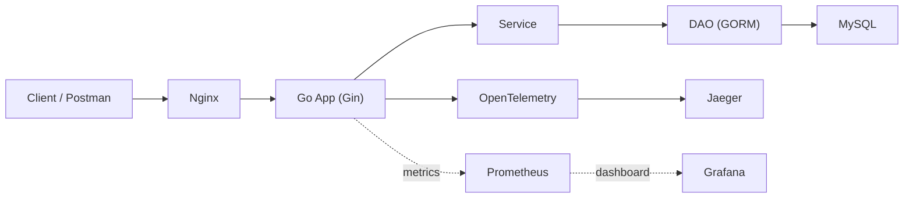

# 第三节课：运维与观测专题课件

## 0. 这节课到底在讲什么

这节课不是在罗列工具，也不是在背概念，而是在回答一个很实际的问题：

> 当一个 Go 项目从"只有业务代码"进化到"像一个真实项目"时，还需要补上哪些工程能力？

今天我们用一个最小 Demo 把这条工程主线串起来：



这张图里其实有两条线：

* 业务线：`Client -> Nginx -> App -> MySQL`
* 观测线：`App -> OpenTelemetry -> Jaeger`，以及概念上的 `Prometheus -> Grafana`

如果只记一句话，请记这句：

> 今天我们要学的是：一个后端项目如何启动、如何接收请求、如何读写数据、如何观察问题、如何排查故障。


---

## 1. 课程目标与非目标

### 1.1 课程目标

学完这节课，你应该能够：


1. 说清楚 Docker、Docker Compose、Nginx、OpenTelemetry、Jaeger、Prometheus、Grafana、CI/CD 分别解决什么问题。
2. 画出一条请求从入口到数据库，再到链路追踪系统的基本路径。
3. 理解 `log / metric / trace` 三类观测数据的分工。
4. 通过一个最小 Demo 完成启动、访问、看日志、看 trace 的全流程。
5. 在出现故障时，按"入口层 / API 层 / 业务层 / 数据层 / 观测层"进行基础排查。

### 1.2 课程非目标

这节课不追求：

* 讲透 Docker、Nginx、OTel 的底层实现
* 构建完整生产级监控平台
* 展开 Kubernetes、Service Mesh、复杂发布策略
* 把 Prometheus、Grafana、CI/CD 做成重实战

本节课只做一件事：

> 先告诉你们有这些东西，并且简单讲解一下，把最小闭环跑通，后续你们做项目时遇到了就会知道："**原来这个东西可以解决这个问题**"，然后去**深度了解**。


---

## 2. 为什么后端项目需要运维与观测能力

很多同学在初学阶段会默认这样理解：

* 写接口 = 后端开发
* 其他东西 = 运维同学的事

但真实项目里，下面这些问题几乎每天都会出现：

| 问题  | 本质  |
|-----|-----|
| 我的电脑能跑，别人的电脑跑不了 | 环境不可复现 |
| 服务已经启动，但请求仍然失败 | 入口层、配置、依赖或网络有问题 |
| 系统变慢了，但不知道慢在哪 | 缺少观测能力 |
| 只知道报错，不知道这次请求经过了什么 | 缺少链路追踪 |
| 发布靠手工操作，容易出错 | 缺少自动化交付 |

所以可以把项目能力粗略分成两类：

| 类别  | 解决什么问题 |
|-----|--------|
| 业务能力 | 功能是否正确 |
| 工程能力 | 系统是否**可运行、可观测、可排查、可交付** |

这节课的主题，就是后者。


---

## 3. 今天的 Demo 与主线

### 3.1 Demo 组件

今天的 Demo 有 4 个真实运行组件：

| 组件  | 作用  |
|-----|-----|
| `nginx` | 统一入口，反向代理到 Go 服务 |
| `app` | Gin + GORM + `api/service/dao` 三层的 Go 服务 |
| `mysql` | 数据存储 |
| `jaeger` | Trace 查询与可视化 |

### 3.2 Demo 提供的接口

| 接口  | 作用  |
|-----|-----|
| `GET /api/health` | 健康检查 |
| `POST /api/users` | 创建用户 |
| `GET /api/users` | 查询用户列表 |
| `GET /api/users/:id` | 查询单个用户 |
| `PUT /api/users/:id` | 更新用户 |
| `DELETE /api/users/:id` | 删除用户 |

### 3.3 课堂主线

这节课的主线不是"讲一个工具，切一次页面"，而是始终围绕一条请求：


1. 请求从客户端进入
2. Nginx 接住请求并转发
3. Go 服务接收请求并进入 `handler`
4. `service` 组织业务逻辑
5. `dao` 使用 GORM 访问 MySQL
6. OpenTelemetry 记录链路
7. Jaeger 展示 trace

只要这条主线不丢，这节课就不会散。


---

## 4. Docker：把"运行环境"打包

### 4.1 Docker 解决什么问题

Docker 首先解决的是环境一致性问题。

在没有容器的时候，你经常会遇到：

* Go 版本不一致
* MySQL 版本不一致
* Nginx 配置不一致
* 本地缺这个依赖、线上缺那个依赖

容器化的核心思想是：

> 把"程序如何运行"也一并打包，而不只是把源码交给别人。

### 4.2 核心概念

| 名词  | 含义  |
|-----|-----|
| Image（镜像） | 一个可复制的运行模板 |
| Container（容器） | 镜像启动后的运行实例 |
| Registry（镜像仓库） | 存放镜像的远程仓库 |
| Dockerfile | 描述"如何构建镜像"的文件 |

### 4.3 Dockerfile 的价值

Dockerfile 其实是在回答：

* 从哪个基础环境开始
* 需要复制哪些文件
* 需要安装哪些依赖
* 最终执行什么命令

本 Demo 的 Go 服务采用的是多阶段构建：


1. 用 `golang:1.26-alpine` 编译 Go 二进制
2. 用 `alpine:3.22` 运行编译结果

为什么这样做：

* 编译环境和运行环境分离
* 运行镜像更小
* 不把整个 Go 工具链带进生产运行环境

### 4.4 容器相关但常被忽略的三个点

| 概念  | 在 Demo 中的体现 |
|-----|-------------|
| 端口映射 | 宿主机 `8080` 对应 Nginx 容器 `80` |
| 容器网络 | `app` 通过 `mysql:3306` 访问数据库 |
| 数据卷 | MySQL 数据保存在 volume 中，不随容器销毁丢失 |


---

## 5. Docker Compose：把"多个容器"组织起来

### 5.1 Compose 解决什么问题

如果只有一个 Go 程序，直接 `go run` 问题不大。\n但今天的 Demo 至少有：

* Nginx
* Go App
* MySQL
* Jaeger

这时如果还靠手工一个个启动，环境管理会迅速失控。\nCompose 的意义就是：

> 用一份**声明式配置**，把多组件环境变成一条命令可复现。

### 5.2 Compose 文件通常描述什么

| 能力  | 说明  |
|-----|-----|
| `services` | 系统里有哪些服务 |
| `build` / `image` | 服务从哪来，是本地构建还是远程镜像 |
| `ports` | 端口如何暴露 |
| `environment` | 运行时配置如何注入 |
| `volumes` | 数据和配置如何挂载 |
| `depends_on` | 启动依赖关系 |
| `healthcheck` | 服务是否真正就绪 |

### 5.3 本 Demo 里的关键 Compose 设计

| 配置  | 作用  |
|-----|-----|
| `mysql.healthcheck` | 避免 app 在数据库尚未就绪时提前启动 |
| `app.build` | 直接从本地 `app/Dockerfile` 构建镜像 |
| `mysql-data` volume | 保存数据库数据 |
| `./mysql/init.sql` | 初始化表结构和示例数据 |
| `./nginx/nginx.conf` | 定义反向代理规则 |

我拿过来贴在这里：

```dockerfile
# ============================================================
# Docker Compose 配置文件
# ============================================================
# 作用：用一份声明式配置，把多组件环境变成一条命令可复现。
# 本 Demo 包含 4 个服务：app（Go 应用）、nginx（反向代理）、mysql（数据库）、jaeger（链路追踪）。
# 使用方式：在 demo 目录下执行 docker compose up --build -d
# ============================================================

services:

  # ----------------------------------------------------------
  # app 服务：Go 后端应用（Gin + GORM + OTel）
  # ----------------------------------------------------------
  # 职责：接收 API 请求，执行业务逻辑，读写数据库，上报链路追踪数据。
  app:
    # build：从本地 Dockerfile 构建镜像，而不是拉取远程镜像。
    # context 指定构建上下文目录为 ./app，Dockerfile 位于该目录下。
    # 多阶段构建（见 Dockerfile）会先用 golang:1.26-alpine 编译，再用 alpine:3.22 运行。
    build:
      context: ./app
      dockerfile: Dockerfile

    # environment：通过环境变量注入运行时配置。
    # 所有值都引用 .env 文件中的变量，实现"一份代码，多份配置"。
    # 这样切换环境（本地/测试/生产）时只需改 .env，不需要改代码或 Compose 文件。
    environment:
      APP_PORT: ${APP_PORT}                         # Go 服务监听端口（如 8080）
      APP_ENV: ${APP_ENV}                           # 运行环境标识（如 development / production）
      GIN_MODE: ${GIN_MODE}                         # Gin 框架运行模式（debug / release）
      MYSQL_HOST: ${MYSQL_HOST}                     # MySQL 主机地址（容器网络中用服务名 mysql 访问）
      MYSQL_PORT: ${MYSQL_PORT}                     # MySQL 端口（容器内部端口 3306）
      MYSQL_USER: ${MYSQL_USER}                     # MySQL 用户名
      MYSQL_PASSWORD: ${MYSQL_PASSWORD}             # MySQL 密码（敏感信息，不硬编码在代码中）
      MYSQL_DATABASE: ${MYSQL_DATABASE}             # MySQL 数据库名
      OTEL_SERVICE_NAME: ${OTEL_SERVICE_NAME}       # OpenTelemetry 服务名，在 Jaeger 中显示为服务标识
      OTEL_EXPORTER_OTLP_ENDPOINT: ${OTEL_EXPORTER_OTLP_ENDPOINT}  # OTel 导出端点，指向 Jaeger 的 OTLP 接收端口

    # depends_on：声明服务启动依赖关系。
    # 注意：depends_on 只控制启动顺序，不代表服务"真正就绪"。
    # 这里 mysql 使用了 condition: service_healthy，表示 app 会等到 mysql 健康检查通过后才启动。
    # 这是避免 app 在数据库尚未就绪时提前连接失败的关键设计。
    depends_on:
      mysql:
        condition: service_healthy    # 等 mysql 健康检查通过
      jaeger:
        condition: service_started    # 只等 jaeger 启动即可（Jaeger 无需健康检查）

    # expose：仅向同一 Docker 网络内的其他容器暴露端口，不映射到宿主机。
    # 这意味着外部无法直接访问 app:8080，必须通过 Nginx 反向代理才能进入。
    # 这是一种安全设计：Nginx 作为统一入口，app 不直接暴露。
    expose:
      - "8080"

    # restart：容器异常退出时自动重启策略。
    # unless-stopped：除非手动停止，否则总是重启。适合生产环境。
    restart: unless-stopped

  # ----------------------------------------------------------
  # nginx 服务：统一入口与反向代理
  # ----------------------------------------------------------
  # 职责：作为所有外部请求的统一入口，将 /api/* 请求转发到 Go 服务。
  # 为什么不直接暴露 Go 服务？因为 Nginx 可以承担负载均衡、静态资源服务、SSL 终止等职责。
  nginx:
    # image：直接使用官方 Nginx 镜像，无需本地构建。
    # alpine 版本更轻量，适合容器环境。
    image: nginx:1.27-alpine

    # ports：将宿主机端口映射到容器端口。
    # 格式为 "宿主机端口:容器端口"。
    # ${NGINX_PORT:-8080} 表示读取环境变量 NGINX_PORT，如果未设置则默认为 8080。
    # 容器内 Nginx 监听 80 端口（见 nginx.conf 中的 listen 80）。
    # 所以最终效果：宿主机 8080 -> Nginx 容器 80 -> 反向代理到 app:8080。
    ports:
      - "${NGINX_PORT:-8080}:80"

    # volumes：将本地文件挂载到容器内。
    # ./nginx/nginx.conf 挂载到容器内 /etc/nginx/conf.d/default.conf，
    # 这是 Nginx 默认加载的配置文件路径。
    # :ro 表示 read-only（只读），容器内不会修改该配置文件。
    volumes:
      - ./nginx/nginx.conf:/etc/nginx/conf.d/default.conf:ro

    # Nginx 依赖 app 服务，确保 app 先启动。
    # 这里只用了 service_started，因为 app 没有配置 healthcheck。
    depends_on:
      app:
        condition: service_started

    restart: unless-stopped

  # ----------------------------------------------------------
  # mysql 服务：数据存储
  # ----------------------------------------------------------
  # 职责：提供关系型数据库服务，存储用户等业务数据。
  mysql:
    # image：使用 MySQL 8.4 官方镜像。
    image: mysql:8.4

    # environment：MySQL 初始化配置。
    # 这些变量在 MySQL 容器首次启动时生效，用于创建 root 用户、数据库和普通用户。
    environment:
      MYSQL_ROOT_PASSWORD: ${MYSQL_ROOT_PASSWORD}   # root 用户密码
      MYSQL_DATABASE: ${MYSQL_DATABASE}             # 首次启动时自动创建的数据库名
      MYSQL_USER: ${MYSQL_USER}                     # 创建一个普通用户
      MYSQL_PASSWORD: ${MYSQL_PASSWORD}             # 普通用户的密码

    # ports：将 MySQL 容器的 3306 端口映射到宿主机。
    # 默认映射到宿主机的 3307 端口，避免与本地可能已安装的 MySQL 冲突。
    # 容器之间通信不经过这个端口映射，而是直接用服务名 + 内部端口（mysql:3306）。
    ports:
      - "${MYSQL_HOST_PORT:-3307}:3306"

    # volumes：数据持久化与初始化。
    volumes:
      # mysql-data 是一个命名卷（named volume），定义在文件底部的 volumes 部分。
      # 将 MySQL 的数据目录 /var/lib/mysql 挂载到该卷。
      # 这样即使容器被删除重建，数据库数据也不会丢失。
      # 这就是"数据卷"的作用：数据不随容器销毁而丢失。
      - mysql-data:/var/lib/mysql
      # 将本地的初始化 SQL 脚本挂载到 MySQL 容器的自动执行目录。
      # MySQL 容器首次启动时会自动执行 /docker-entrypoint-initdb.d/ 下的 .sql 文件。
      # 这确保了数据库表结构和示例数据在启动时就自动创建好。
      - ./mysql/init.sql:/docker-entrypoint-initdb.d/init.sql:ro

    # healthcheck：容器健康检查配置。
    # 这是本 Demo 中一个非常关键的设计点。
    # 问题背景：depends_on 只保证启动顺序，不保证服务就绪。
    # MySQL 启动后需要几秒到十几秒才能真正接受连接，如果 app 提前连接就会报错。
    # healthcheck 让 Docker 定期检查 MySQL 是否真正可用，
    # 只有健康检查通过后，依赖它的 app 服务才会启动。
    healthcheck:
      # test：健康检查命令。
      # 使用 mysqladmin ping 命令检测 MySQL 是否可以响应连接。
      # -h 127.0.0.1：连接本机（容器内）的 MySQL。
      # -uroot：使用 root 用户。
      # -p$${MYSQL_ROOT_PASSWORD}：使用环境变量中的 root 密码。
      # 注意：$$ 是 Compose 中的转义，表示 $ 符号本身（避免被 Compose 的变量替换机制误解析）。
      # --silent：安静模式，只在连接失败时输出信息。
      test:
        [
          "CMD-SHELL",
          "mysqladmin ping -h 127.0.0.1 -uroot -p$${MYSQL_ROOT_PASSWORD} --silent",
        ]
      interval: 5s        # 每 5 秒执行一次健康检查
      timeout: 5s         # 单次检查超时时间 5 秒
      retries: 20         # 连续失败 20 次才标记为 unhealthy（最多等待 20*5=100 秒）
      start_period: 20s   # 容器启动后 20 秒内的失败不计入 retries（给 MySQL 充足的初始化时间）

    restart: unless-stopped

  # ----------------------------------------------------------
  # jaeger 服务：链路追踪的可视化后端
  # ----------------------------------------------------------
  # 职责：接收 OpenTelemetry 导出的 trace 数据，并提供 Web UI 查看。
  # 数据流：Go App -> OTLP HTTP Exporter -> Jaeger (端口 4318)。
  # Jaeger UI 端口为 16686，可以在浏览器中查看请求的完整链路。
  jaeger:
    # image：使用 Jaeger 官方镜像。
    # 该镜像默认以 all-in-one 模式运行，包含 collector + query + UI，适合开发和教学。
    image: cr.jaegertracing.io/jaegertracing/jaeger:2.15.0

    # ports：暴露 Jaeger UI 端口。
    # 默认映射到宿主机的 16686 端口，浏览器访问 http://localhost:16686 即可打开 Jaeger UI。
    # Jaeger 还会自动监听 4318 端口（OTLP HTTP 接收端口），app 通过该端口上报 trace 数据。
    # 容器间通过 jaeger:4318 访问，不需要端口映射。
    ports:
      - "${JAEGER_UI_PORT:-16686}:16686"

    restart: unless-stopped

# ============================================================
# volumes：命名卷定义
# ============================================================
# 命名卷由 Docker 管理，数据持久化在宿主机的 Docker 存储区域。
# 相比 bind mount（直接挂载本地目录），命名卷更适合存放数据库等需要 Docker 管理的数据。
# 执行 docker compose down 时卷不会被删除（需要加 -v 参数才会删除）。
# ============================================================
volumes:
  mysql-data:    # MySQL 数据持久化卷，挂载到 mysql 服务的 /var/lib/mysql
```

### 5.4 常见误区

| 误区  | 说明  |
|-----|-----|
| `depends_on` 等于服务就绪 | 错，它只保证启动顺序，真正就绪还要配合 `healthcheck` |
| 容器间访问要用 `localhost` | 错，容器之间通常使用**服务名**访问 |
| Compose 只用于上线 | 错，本地开发和教学环境也很适合 |


---

## 6. Nginx：入口层与反向代理

### 6.1 为什么请求通常不直接进业务服务

真实项目里，请求往往不会直接访问后端进程，而是先经过统一入口层。\n入口层可以承担：

* 反向代理
* 统一域名入口
* 后续扩展负载均衡
* 通用头处理
* 静态资源服务

Nginx 在今天的角色，就是这个入口层。

### 6.2 正向代理与反向代理

| 类型  | 站在哪一边 |
|-----|-------|
| 正向代理 | 更像"帮客户端访问外部" |
| 反向代理 | 更像"帮服务端接住请求再转发" |

今天我们用的是**反向代理**。

### 6.3 本 Demo 中的 Nginx 在做什么

`http://localhost:8080/api/*` 实际并不是直接打到 Go 程序，而是：


1. 先到 Nginx
2. Nginx 把 `/api/*` 转发到 `app:8080`
3. Go 服务再处理业务逻辑

### 6.4 与排障相关的常见状态

| 现象  | 常见方向 |
|-----|------|
| `404` | Nginx 路由没匹配，或应用路由没匹配 |
| `502 Bad Gateway` | 上游服务挂了、地址错了、端口错了 |
| `504 Gateway Timeout` | 上游处理太慢或超时设置不合理 |

排查顺序建议：


1. 看 `nginx` 日志
2. 看 `app` 日志
3. 看转发配置和上游地址


---

## 7. 应用层结构：Gin、GORM 与 `api/service/dao`

### 7.1 为何观测的Demo虽小，但是还是上了三层结构？

本 Demo 用的是：

* `api`：收请求、回响应
* `service`：组织业务流程
* `dao`：访问数据库

这不只是"代码风格"，更和排障效率强相关：

| 层   | 常见错误 |
|-----|------|
| `api` | 参数解析失败、请求体错误、路径参数错误 |
| `service` | 业务规则不通过、流程中断 |
| `dao` | 数据库连接失败、唯一键冲突、查询失败 |

因此，日志和 trace 一旦带有分层信息，定位速度会快很多。


---

## 8. 配置管理：让"会变的信息"脱离代码

### 8.1 什么叫配置

配置不是"程序里所有常量"，而是那些：

* 会因为环境变化而变化
* 但不应该要求你反复改代码

例如：

* 数据库地址和端口
* 服务端口
* OTel 导出地址
* 运行环境标识

### 8.2 为什么不能把配置写死在代码里

假设数据库地址写死成：

```text
mysql:3306
```

那本地环境、测试环境、线上环境只要有任何一个不同，你都得改代码。\n这会直接带来两个问题：

* 代码和环境耦合过紧
* 发布和切环境时容易出错

### 8.3 本 Demo 的最小配置方案

今天我们不引入配置中心，只用环境变量。

核心配置包括：

* `APP_PORT`
* `MYSQL_HOST`
* `MYSQL_PORT`
* `MYSQL_USER`
* `MYSQL_PASSWORD`
* `MYSQL_DATABASE`
* `OTEL_SERVICE_NAME`
* `OTEL_EXPORTER_OTLP_ENDPOINT`

### 8.4 多环境思维

即使是同一套代码，不同环境也常有这些差异：

| 环境差异 | 示例  |
|------|-----|
| 数据库地址不同 | 本地是容器名，线上可能是内网地址 |
| 日志级别不同 | 本地调试更详细，线上更克制 |
| 观测后端不同 | 本地 Jaeger，线上可能是集中观测平台 |
| 外部依赖不同 | 测试和生产的第三方地址不同 |

所以更合理的工程模式是：

> 一份代码，多份配置。

### 8.5 `.gitignore` 与敏感配置

配置管理里还有一个很容易被忽略、但非常重要的问题：

> 哪些配置能进 Git，哪些绝对不能进 Git？

最基本的原则是：

* 可以提交"示例配置"
* **不要提交"真实敏感配置"**

#### 8.5.1 哪些内容通常不应该提交到 Git

| 内容  | 原因  |
|-----|-----|
| `.env` | 往往包含数据库密码、密钥、第三方令牌 |
| 私钥文件 | 一旦泄露，风险非常高 |
| 线上真实配置文件 | 可能暴露内部地址、账号、密码 |
| 本地开发个人配置 | 每个人环境不同，提交后容易互相污染 |

因此项目里通常会把这些内容加入 `.gitignore`。

例如：

```gitignore
.env
.env.local
*.key
*.pem
```

#### 8.5.2 那配置文件完全不提交吗

也不是。\n更推荐的做法是提交"**示例配置**"给团队参考，例如：

* `.env.example`
* `config.example.yaml`

这些文件里只保留：

* 配置项名称
* 示例值
* 注释说明

而不放真实密码和真实密钥。

#### 8.5.3 一个常见错误

很多同学会这样做：


1. 本地写了 `.env`
2. 里面放了数据库密码
3. 直接 `git add .`
4. 把敏感信息一起推上远程仓库

这在真实项目里是很危险的。

#### 8.5.4 这件事和今天的 Demo 有什么关系

今天这个 Demo 目录里就有：

* `.env`
* `.env.example`

其中：

* `.env` 用来本地真实运行
* `.env.example` 用来告诉别人"需要哪些配置"

所以一个更规范的做法是：

* 把 `.env` 加进 `.gitignore`
* 把 `.env.example` 提交到 Git

这样既能保证项目可复现，也能避免把敏感信息提交出去。


---

## 9. 可观测性：Log、Metric、Trace 是三条不同的线

"可观测性"不是某一个工具，而是一种能力。\n它的核心是：系统出问题时，你能不能从外部行为反推出内部状态。

最常见的三类观测数据是：

| 类型  | 解决什么问题 |
|-----|--------|
| Log | 具体发生了什么错误 |
| Metric | 系统整体是否异常 |
| Trace | 一次请求具体经过了哪些步骤 |

### 9.1 Log（日志）

适合回答：

* 这次报错具体是什么
* 当时输入参数是什么
* 某段代码走到了哪里

日志的优势是细节丰富，缺点是如果系统调用链很长，只看日志很难自然串起完整请求。

### 9.2 Metric（指标）

适合回答：

* 最近 10 分钟错误率是否上升
* 请求延迟是否普遍升高
* QPS 是否异常变化

常见指标包括：

* `QPS`
* 平均延迟
* `P95 / P99`
* 错误率
* 活跃连接数

指标适合看"整体趋势"，但不擅长解释某一次具体请求到底发生了什么。

### 9.3 Trace（链路）

适合回答：

* 一次请求经过了哪些步骤
* 哪一步最耗时
* 错误发生在哪个阶段

Trace 擅长看"单次请求的细节路径"，这正是链路追踪的价值。

### 9.4 三者如何配合

一个典型排障过程可能是：


1. 在 Grafana 看到错误率上升
2. 去 Jaeger 找到失败请求的 trace
3. 根据最慢或报错的 span 回到日志查细节

这就是为什么说：

> 日志、指标、链路不是竞争关系，而是协同关系。


---

## 10. OpenTelemetry：把观测接进代码

### 10.1 OpenTelemetry 到底是什么

OpenTelemetry 不是可视化页面，也不是单一产品。\n它更像一套观测标准和 SDK 体系，用来统一：

* 如何产生观测数据
* 如何传播上下文
* 如何把数据导出到后端系统

这节课里我们只用它的 Trace 能力。

### 10.2 关键概念

| 名词  | 含义  |
|-----|-----|
| `Trace` | 一次请求的完整轨迹 |
| `Span` | 轨迹中的一个步骤 |
| `Tracer` | 用来创建 span 的对象 |
| `Context` | 在调用链上传递 trace 上下文 |
| `Exporter` | 把采集数据导出到后端 |
| `Propagation` | 把 trace 上下文沿调用链传下去 |

### 10.3 Trace 与 Span

如果把一次请求看成一条旅行路线：

* 整条路线叫 `Trace`
* 路线上的每一站叫 `Span`

在今天的 Demo 里，一次 `GET /api/users` 请求可以拆成：

* `GET /api/users`
* `api.user.list`
* `service.user.list`
* `dao.user.list`

这就是为什么在 Jaeger 里你会看到多层 span。

### 10.4 自动埋点与手动埋点

OpenTelemetry 的接入通常分两类：

| 类型  | 特点  |
|-----|-----|
| 自动埋点 | 接入快，能覆盖框架级基础链路 |
| 手动埋点 | 更贴近业务，能表达真正重要的步骤 |

今天我们两者都用了：

* 自动埋点：`otelgin` 给 HTTP 请求生成基础 span
* 手动埋点：在 `service / dao` 层补业务 span

### 10.5 为什么强调 Context

在 Go 里，`context.Context` 不只是超时取消的载体，\n也是 trace 上下文传播的重要通道。

如果不把 context 往下传，会发生什么？

* handler 有 trace
* service 没接到 context
* dao 也没接到 context
* 最终链路在中间断掉

这就是为什么后面学 RPC 时，context 会更重要。

### 10.6 Exporter 与后端系统

OpenTelemetry 本身不负责"展示所有结果"，\n它负责把数据导出去。

今天的路径是：

```text
Go App -> OTLP HTTP Exporter -> Jaeger
```

也就是说：

* OTel 负责采集和导出
* Jaeger 负责接收和查看


---

## 11. Jaeger：看懂一条 Trace

### 11.1 Jaeger 是什么

Jaeger 是一个链路追踪系统。\n它能：

* 接收 trace 数据
* 存储并查询 trace
* 提供 UI 让人查看请求路径

### 11.2 在 Jaeger 页面你通常看什么

| 项   | 含义  |
|-----|-----|
| Service | 哪个服务产生的 trace |
| Operation | 某类操作，比如某个接口 |
| Trace 列表 | 最近的请求记录 |
| Span 时间线 | 每个步骤耗时多长 |
| Tags / Attributes | span 的附加信息 |

### 11.3 如何读一条 Trace

建议按这个顺序读：


1. 先看总耗时是否真的异常
2. 再看哪个 span 最慢
3. 再看最慢 span 在 `api / service / dao` 哪一层
4. 再回应用日志确认具体错误细节

### 11.4 Jaeger 擅长什么，不擅长什么

| 擅长  | 不擅长 |
|-----|-----|
| 单次请求路径分析 | 长期趋势分析 |
| 慢请求定位 | 聚合看板展示 |
| 调用关系展示 | 指标级大盘 |

所以 Jaeger 常常不是独自使用，而是和日志、指标系统配合使用。


---

## 12. Prometheus 与 Grafana：指标这条线

### 12.1 为什么今天必须提它们

如果只讲 Jaeger，大家很容易误以为：

> 只要有 trace，观测问题就全解决了。

其实不是。\nTrace 擅长看**一次请求**，Metric 擅长看**整体趋势**。\nPrometheus 和 Grafana 就属于**指标**这条线的常见组合。

### 12.2 Prometheus 是什么

Prometheus 是**指标采集与存储系统**。\n它常见的工作模式是：


1. 应用暴露指标接口
2. Prometheus 周期性抓取
3. 把采集到的指标按时间序列存储

你可以把它理解为：

> 系统体征记录器。

### 12.3 Grafana 是什么

Grafana 是可视化平台。\n它本身通常不负责采集数据，而是：

* 连接 Prometheus
* 做仪表盘
* 展示曲线、看板和告警视图

你可以把它理解为：

> 指标数据的观察窗口。

### 12.4 常见指标类型

在接触 Prometheus 时，经常会看到这些指标思路：

| 类型  | 适合表示什么 |
|-----|--------|
| Counter | 只增不减的累计值，如请求总数 |
| Gauge | 可增可减的当前值，如连接数 |
| Histogram | 一组分桶统计，常用于延迟分布 |

### 12.5 Jaeger 与 Prometheus/Grafana 的关系

| 工具  | 更适合回答什么 |
|-----|---------|
| Jaeger | 这一次请求怎么走的 |
| Prometheus | 最近 10 分钟整体是否异常 |
| Grafana | 这些异常趋势如何展示出来 |

一个经典排障流程是：


1. 在 Grafana 看见接口错误率升高
2. 去 Jaeger 找失败请求的 trace
3. 回日志看具体错误

这就是"指标 -> 链路 -> 日志"的联动思路。


---

## 13. CI/CD：从"能跑"到"能交付"

### 13.1 CI 是什么

CI（持续集成）通常指代码提交后自动执行：

* 编译
* 测试
* 静态检查

### 13.2 CD 是什么

CD（持续交付 / 持续部署）通常指：

* 构建产物自动发布
* 镜像自动推送
* 服务自动部署

### 13.3 一个最小流水线长什么样

最简化地看，一条现代后端流水线可能是：


1. 拉代码
2. 安装依赖
3. 跑测试
4. 构建镜像
5. 推送镜像
6. 部署到目标环境

### 13.4 它和这节课的关系

今天我们没有重做 CI/CD 平台配置，但你应该知道：

* Docker 镜像天然适合作为交付产物
* 配置管理是发布到不同环境的基础
* 自动化交付能减少手工发布错误

所以这节课其实已经在为 CI/CD 铺路。


---

## 14. 实操：把 Demo 跑起来

PS:下述的curl相关命令，也可以使用apifox或者其他请求软件来代替。**如果需要导入apifox，请使用根目录的openapi.yaml**。

### 14.1 启动项目

```powershell
cd ~/redrock-backend-third-class/demo
docker compose up --build -d
docker compose ps #或者打开Docker Desktop
```

你应该看到 `nginx`、`app`、`mysql`、`jaeger` 都处于运行状态。

### 14.2 健康检查

```powershell
curl http://localhost:8080/api/health
```

关注返回值：

* `message`
* `database`
* `trace_id`

这一步说明三件事：


1. Nginx 能接住请求
2. Go 服务能处理请求
3. 数据库连通性正常

### 14.3 创建用户

```powershell
curl -X POST http://localhost:8080/api/users `
  -H "Content-Type: application/json" `
  -d "{\"name\":\"Alice\",\"email\":\"alice@example.com\"}"
```

这一步会触发：

* HTTP 请求进入
* 参数绑定
* service 校验
* dao 写库
* trace 生成

### 14.4 查询用户列表

```powershell
curl http://localhost:8080/api/users
```

这是最适合拿来看 Jaeger 的接口之一，因为它的 span 结构最清晰。

### 14.5 看应用日志

```powershell
docker compose logs -f app
```

重点观察：

* `layer`
* `trace_id`
* `path`
* `status`

### 14.6 看 Jaeger

打开：

`http://localhost:16686`

操作步骤：


1. 选择 service：`ops-observe-demo`
2. 点击 `Find Traces`
3. 点开一条 `GET /api/users` 或 `POST /api/users`

你会看到类似 span：

* `GET /api/users`
* `api.user.list`
* `service.user.list`
* `dao.user.list`

这说明我们的"分层 + trace"主线已经打通。


---

## 15. 从代码结构理解这条链路

本 Demo 中，建议重点看这些文件：

| 文件  | 关注点 |
|-----|-----|
| `demo/docker-compose.yml` | 多服务启动关系 |
| `demo/nginx/nginx.conf` | 入口层如何转发 |
| `demo/app/cmd/server/main.go` | 服务初始化、路由、OTel、数据库 |
| `demo/app/internal/api/handler/user.go` | API 层职责 |
| `demo/app/internal/service/user.go` | 业务层职责 |
| `demo/app/internal/dao/user.go` | 数据层与 span |
| `demo/app/internal/telemetry/telemetry.go` | OTel 初始化 |

建议用这张对应关系理解：

| 运行时现象 | 对应代码位置 |
|-------|--------|
| 请求进来  | `handler` |
| 业务逻辑执行 | `service` |
| 数据库访问 | `dao`  |
| trace 初始化 | `telemetry` |
| 统一启动  | `main.go` |


---

## 16. 常见报错与排查方法

### 16.1 `docker compose up` 失败

先看：

```powershell
docker compose ps
docker compose logs -f
```

优先确定是哪一个容器先失败。

### 16.2 `health` 返回数据库不可用

先看：

```powershell
docker compose logs -f mysql
docker compose logs -f app
```

再核对配置：

* `MYSQL_HOST`
* `MYSQL_PORT`
* `MYSQL_USER`
* `MYSQL_PASSWORD`
* `MYSQL_DATABASE`

### 16.3 Jaeger 页面能开，但没有 trace

先确认：


1. 你是否真的发过请求
2. `OTEL_EXPORTER_OTLP_ENDPOINT` 是否正确
3. app 日志中是否能看到 `trace_id`

### 16.4 创建用户返回邮箱重复

这不是系统坏了，而是业务规则生效。\n它说明：

* service 层有业务校验
* 系统不是"只会 happy path"

### 16.5 如何按层排障

一个很实用的顺序是：


1. 先判断是入口层、API 层、业务层还是数据层
2. 再去对应层日志找细节
3. 再用 Jaeger 看链路位置和耗时

不要上来就盲查所有代码。


---

## 17. 与前后课程的衔接

### 17.1 与前面的 Redis、消息队列课的关系

当系统开始接 Redis、消息队列之后：

* 依赖会变多
* 链路会变长
* 排障会更复杂

所以容器化和观测能力会变得更重要。

### 17.2 与下一节 RPC 课的关系

下一节一旦进入 RPC，多服务调用会带来：

* 更长的链路
* 更复杂的上下文传播
* 更高的超时与重试风险

今天这节课其实是在做铺垫：

* 请求要能被观察
* 上下文要能传递
* 错误要能分层定位


---

## 18. 本节小结

请记住下面这 8 句话：


1. Docker 解决单个服务的可打包运行问题。
2. Docker Compose 解决多个服务的一致启动问题。
3. Nginx 让请求先经过入口层，再进入业务服务。
4. 配置管理的核心是"让会变的信息脱离代码"。
5. 可观测性不是单个工具，而是 `log / metric / trace` 的组合能力。
6. OpenTelemetry 负责接入和导出，Jaeger 负责查看链路。
7. Prometheus + Grafana 更适合看整体趋势，不是看单次请求细节。
8. `api / service / dao` 分层不仅是代码结构，也是在给排障提供线索。


---

## 课后作业

### 必做


1. 启动整个 Demo，照着课上的步骤操作一遍。

### 选做


1. 后面的秒杀考核项目，若有时间，可以把这一套都安排上，并且可以在答辩的时候演示。

### 提交方式

不用提交。等后面考核答辩的时候统一验收就行。


---

## 附录 访问地址速查

| 服务  | 地址  | 说明  |
|-----|-----|-----|
| Nginx 入口（API） | http://localhost:8080 | 所有 `/api/*` 请求的统一入口，由 Nginx 反向代理到 Go 服务 |
| 健康检查 | http://localhost:8080/api/health | 检查服务进程与数据库连通性 |
| 用户 CRUD | http://localhost:8080/api/users | 用户相关接口（GET / POST） |
| 单个用户操作 | http://localhost:8080/api/users/{id} | 用户详情 / 更新 / 删除（GET / PUT / DELETE） |
| **Jaeger UI** | http://localhost:16686 | 链路追踪可视化页面，选择 service `ops-observe-demo` 查看 trace |
| MySQL | localhost:3307 | MySQL 容器映射到宿主机的端口，可用本地客户端连接（用户名 `demo`，密码 `demo123`，数据库 `observability_demo`） |


---

## 附录 命令速查

```powershell
# 启动
docker compose up --build -d

# 查看状态
docker compose ps

# 查看应用日志
docker compose logs -f app

# 停止
docker compose down

# 停止并删除数据卷
docker compose down -v
```

```powershell
# 健康检查
curl http://localhost:8080/api/health

# 创建用户
curl -X POST http://localhost:8080/api/users `
  -H "Content-Type: application/json" `
  -d "{\"name\":\"Alice\",\"email\":\"alice@example.com\"}"

# 查询用户列表
curl http://localhost:8080/api/users
```